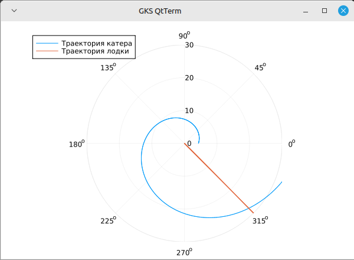
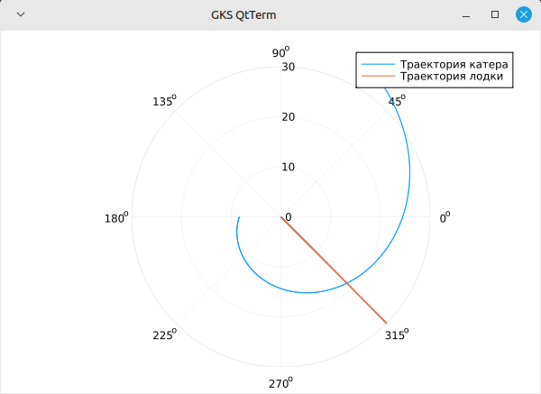

---
## Front matter
lang: ru-RU
title: Лабораторная работа №2
subtitle: Математическое моделирование 
author:
  - Дудырев Г. А.
date: 8 марта 2025

## i18n babel
babel-lang: russian
babel-otherlangs: english

## Formatting pdf
toc: false
toc-title: Содержание
slide_level: 2
aspectratio: 169
section-titles: true
theme: metropolis
header-includes:
 - \metroset{progressbar=frametitle,sectionpage=progressbar,numbering=fraction}
 - '\makeatletter'

 - '\makeatother'
---

## Докладчик

:::::::::::::: {.columns align=center}
::: {.column width="70%"}

  * Дудырев Глеб Андреевич
  * НПИбд-02-22

:::
::: {.column width="30%"}


:::
::::::::::::::

## Цели и задачи

- Построить математическую модель для выбора правильной стратегии при решении примера задаче о погоне.

## Определение варианта

{#fig:001 width=70%}

## Задача

Вариант 14.

На море в тумане катер береговой охраны преследует лодку браконьеров. Через определенный промежуток времени туман рассеивается, и лодка обнаруживается на расстоянии 7.5 км от катера. Затем лодка снова скрывается в тумане и уходит прямолинейно в неизвестном направлении. Известно, что скорость катера в 3.1 раза больше скорости браконьерской лодки.

1. Запишите уравнение, описывающее движение катера, с начальными условиями для двух случаев (в зависимости от расположения катера относительно лодки в начальный момент времени).
2. Постройте траекторию движения катера и лодки для двух случаев.
3. Найдите точку пересечения траектории катера и лодки

# Выполнение лабораторной работы

## Решение задачи

Чтобы найти расстояние $x$ (расстояние после которого катер начнет двигаться вокруг полюса), необходимо составить простое уравнение:

$$
\dfrac{x}{v} = \dfrac{k-x}{3.1v} \text{ -- в первом случае}
$$
$$
\dfrac{x}{v} = \dfrac{k+x}{3.1v} \text{ -- во втором}
$$

Отсюда находим два значения $x_1 = \dfrac{7.5}{4.1}$ и $x_2 = \dfrac{7.5}{2.1}$, задачу будем решать для двух случаев.

## Решение задачи

Тангенциальная скорость – это линейная скорость вращения катера относительно полюса. Она равна произведению угловой скорости $\dfrac{d \theta}{dt}$ на радиус $r$, $r \dfrac{d \theta}{dt}$.

Получаем: 

$$v_{\tau} = \sqrt{9.61v^2-v^2} = \sqrt{8.61}v$$

Из чего можно вывести:

$$
r\dfrac{d \theta}{dt} = \sqrt{8.61}v
$$

## Решение задачи

Решение исходной задачи сводится к решению системы из двух дифференциальных уравнений:

$$\begin{cases}
&\dfrac{dr}{dt} = v\\
&r\dfrac{d \theta}{dt} = \sqrt{8.61}v
\end{cases}$$

## Решение задачи

С начальными условиями для первого случая:

$$\begin{cases}
&{\theta}_0 = 0\\  \tag{1}
&r_0 = \dfrac{7.5}{4.1}
\end{cases}$$

Или для второго:

$$\begin{cases}
&{\theta}_0 = -\pi\\  \tag{2}
&r_0 = \dfrac{7.5}{2.1}
\end{cases}$$

## Решение задачи

Исключая из полученной системы производную по $t$, можно перейти к следующему уравнению:

$$
\dfrac{dr}{d \theta} = \dfrac{r}{\sqrt{8.61}}
$$

# Построение модели

## Начало работы

```Julia
k=7.5 //расстояние от лодки до катера
//данные для лодки браконьеров
fi=3*pi/4
t=0:0.01:30
fl(t)=tan(fi)*t //функция, описывающая движение лодки браконьеров
f(u, p, t)=u/sqrt(8.61) //функция, описывающая движение катера береговой охраны
//начальные условия для двух случаев
x1 = k/4.1
x2 = k/2.1
tetha1 = (0.0, 2*pi)
tetha2 = (-pi, pi)
```

## Первый случай

```Julia
s1=ODEProblem(f, x1, tetha1)
sol1=solve(s1, Tsit5(), saveat=0.01)
```

```Julia
plot(sol1.t, sol1.u, proj=:polar, lims=(0,30), label="Траектория катера")
plot!(fill(fi, length(t)), fl.(t), label="Траектория лодки")
```

## Первый случай

{#fig:002 width=70%}

## Второй случай

```Julia
s2=ODEProblem(f, x2, tetha2)
sol2=solve(s2, Tsit5(), saveat=0.01)
```

```Julia
plot(sol2.t, sol2.u, proj=:polar, lims=(0,30), label="Траектория катера")
julia> plot!(fill(fi, length(t)), fl.(t), label="Траектория лодки")
```

## Второй случай

{#fig:003 width=70%}

# Вывод точки пересечения

## Задача Коши

$$
r = \dfrac{176\,{e}^{\frac{10\,\theta}{\sqrt{2109}}}}{57} \text{ -- для случая (1)}
$$

$$
r = \dfrac{176\,{e}^{\frac{10\,\theta}{\sqrt{2109}}+\frac{10\,\pi}{\sqrt{2109}}}}{37} \text{ -- для случая (2)}
$$

## Первый случай

Найдем точку пересечения для первого случая - $( \dfrac{3 \pi}{4}, 5.157738803750548)$.

```Julia
julia> y(x)=(176*exp(10*x/sqrt(2109)))/57
y (generic function with 1 method)
julia> y(fi)
5.157738803750548
```

## Второй случай

Найдем точку пересечения для второго случая -  $(-\dfrac{\pi}{4}, 2.6023395843910384)$.

```Julia
julia> y2(x)=(176*exp((10*x/sqrt(2109))+(10*pi/sqrt(2109))))/37
y2 (generic function with 1 method)
julia> y(fi-pi)
2.6023395843910384
```

## Вывод

- В процессе выполнения данной лабораторной работы я построила математическую модель для выбора правильной стратегии при решении примера задаче о погоне.