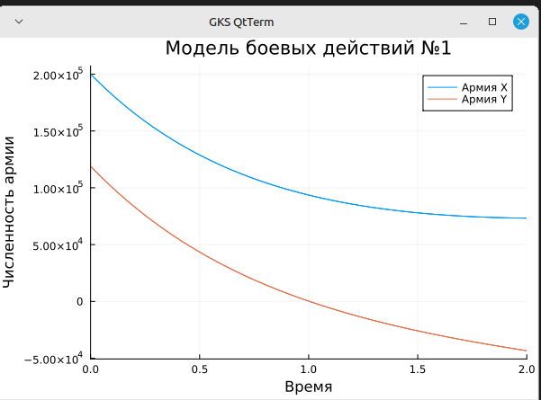
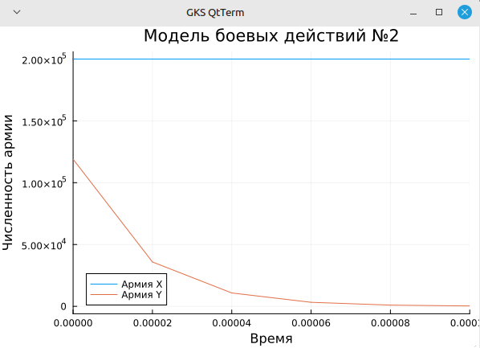
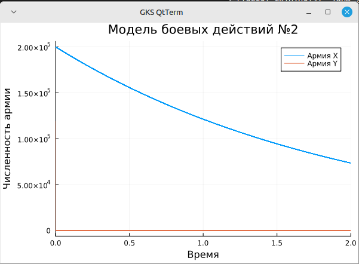

---
## Front matter
lang: ru-RU
title: Лабораторная работа №3
subtitle: Математическое моделирование 
author:
  - Дудырев Г. А.
date: 8 марта 2025

## i18n babel
babel-lang: russian
babel-otherlangs: english

## Formatting pdf
toc: false
toc-title: Содержание
slide_level: 2
aspectratio: 169
section-titles: true
theme: metropolis
header-includes:
 - \metroset{progressbar=frametitle,sectionpage=progressbar,numbering=fraction}
 - '\makeatletter'

 - '\makeatother'
---

## Докладчик

:::::::::::::: {.columns align=center}
::: {.column width="70%"}

  * Дудырев Глеб Андреевич
  * НПИбд-02-22

:::
::: {.column width="30%"}


:::
::::::::::::::

## Цели и задачи

- Построить модель боевых действий на языке прогаммирования Julia.

## Задача

Формула для выбора варианта: (1132226532 % 70) + 1 = 14 Вариант.

Между страной $X$ и страной $Y$ идет война. Численность состава войск исчисляется от начала войны, и являются временными функциями $x(t)$ и $y(t)$. В начальный момент времени страна $X$ имеет армию численностью 200000 человек, а в распоряжении страны $Y$ армия численностью в 119000 человек. Для упрощения модели считаем, что коэффициенты $a, b, c, h$ постоянны. Также считаем $P(t)$ и $Q(t)$ непрерывные функции.

# Выполнение лабораторной работы

## Модель боевых действий между регулярными войсками

$$\begin{cases}
    \dfrac{dx}{dt} = -0.5x(t)-0.8y(t)+sin(t+5)+1\\
    \dfrac{dy}{dt} = -0.7x(t)-0.5y(t)+cos(t+3)+1
\end{cases}$$

## Создание модели в Julia

Для начала построим эту модель на Julia:

```Julia
# используемые библиотеки
using DifferentialEquations, Plots
# задание системы дифференциальных уравнений, описывающих модель 
# боевых действий между регулярными войсками
function reg(u, p, t)
	x, y = u
	a, b, c, h = p
	dx = -a*x - b*y + sin(t + 1) + 1
	dy = -c*x - h*y + cos(t + 2) + 1
	return [dx, dy]
end
# начальные условия
u0 = [200000, 119000]
p = [0.5, 0.8, 0.7, 0.5]
tspan = (0, 2)
# постановка проблемы
prob = ODEProblem(reg, u0, tspan, p)
# решение системы ДУ
sol = solve(prob, Tsit5())
# построение графика, который описывает изменение численности армий
plot(sol, title = "Модель боевых действий №1",  label = ["Армия X" "Армия Y"], xaxis = "Время", yaxis = "Численность армии")
```
## Полученный график



## Модель ведение боевых действий с участием регулярных войск и партизанских отрядов

$$\begin{cases}
    \dfrac{dx}{dt} = -0.5x(t)-0.8y(t)+sin(10t)\\
    \dfrac{dy}{dt} = -0.3x(t)y(t)-0.5y(t)+cos(10t)
\end{cases}$$

## Создание модели в Julia

```Julia
# используемые библиотеки
using DifferentialEquations, Plots
# задание системы дифференциальных уравнений, описывающих модель 
# боевых действий между регулярными войсками
function reg_part(u, p, t)
  x, y = u
  a, b, c, h = p
  dx = -a*x - b*y + sin(10t)
  dy = -c*x*y - h*y + cos(10t)
  return [dx, dy]
end
# начальные условия
u0 = [200000, 119000]
p = [0.5, 0.8, 0.3, 0.5]
tspan = (0, 2)
# постановка проблемы
prob2 = ODEProblem(reg_part, u0, tspan, p)
# решение системы ДУ
sol2 = solve(prob2, Tsit5())
# построение графика, который описывает изменение численности армий
plot(sol2, title = "Модель боевых действий №2",  label = ["Армия X" "Армия Y"], xaxis = "Время", yaxis = "Численность армии")
```
{#fig:004 width=60%}

## Полученный график



## Полученный график


# Выводы

В процессе выполнения данной лабораторной работы я построил модель боевых действий на языке прогаммирования Julia, а также провел сравнительный анализ.
