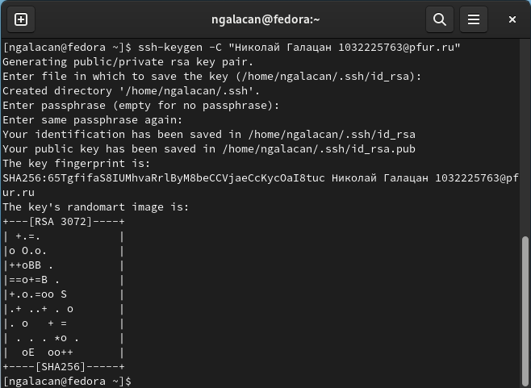

---
## Front matter
title: "Отчёт по лабораторной работе №3"
subtitle: "Дисциплина: Математическое моделирование"
author: "Дудырев Глеб Андреевич"

## Generic options
lang: ru-RU
toc-title: "Содержание"

## Bibliography
bibliography: bib/cite.bib
csl: pandoc/csl/gost-r-7-0-5-2008-numeric.csl

## Pdf output format
toc: true # Table of contents
toc-depth: 2
lof: true # List of figures
lot: true # List of tables
fontsize: 14pt
linestretch: 1.5
papersize: a4
documentclass: scrreprt
## I18n polyglossia
polyglossia-lang:
  name: russian
  options:
	- spelling=modern
	- babelshorthands=true
polyglossia-otherlangs:
  name: english
## I18n babel
babel-lang: russian
babel-otherlangs: english
## Fonts
mainfont: PT Serif
romanfont: PT Serif
sansfont: PT Sans
monofont: PT Mono
mainfontoptions: Ligatures=TeX
romanfontoptions: Ligatures=TeX
sansfontoptions: Ligatures=TeX,Scale=MatchLowercase
monofontoptions: Scale=MatchLowercase,Scale=0.9
## Biblatex
biblatex: true
biblio-style: "gost-numeric"
biblatexoptions:
  - parentracker=true
  - backend=biber
  - hyperref=auto
  - language=auto
  - autolang=other*
  - citestyle=gost-numeric
## Pandoc-crossref LaTeX customization
figureTitle: "Рис."
tableTitle: "Таблица"
listingTitle: "Листинг"
lofTitle: "Список иллюстраций"
lotTitle: "Список таблиц"
lolTitle: "Листинги"
## Misc options
indent: true
header-includes:
  - \usepackage{indentfirst}
  - \usepackage{float} # keep figures where there are in the text
  - \floatplacement{figure}{H} # keep figures where there are in the text
---

# Цель работы

Построить модель боевых действий на языке прогаммирования Julia.

# Задание

Формула для выбора варианта: (1132226532 % 70) + 1 = 14 Вариант.

Между страной $X$ и страной $Y$ идет война. Численность состава войск исчисляется от начала войны, и являются временными функциями $x(t)$ и $y(t)$. В начальный момент времени страна $X$ имеет армию численностью 200000 человек, а в распоряжении страны $Y$ армия численностью в 119000 человек. Для упрощения модели считаем, что коэффициенты $a, b, c, h$ постоянны. Также считаем $P(t)$ и $Q(t)$ непрерывные функции.

Построить графики изменения численности войск армии $X$ и армии $Y$ для  следующих случаев:

1. Модель боевых действий между регулярными войсками

$$\begin{cases}
    \dfrac{dx}{dt} = -0.5x(t)-0.8y(t)+sin(t+5)+1\\
    \dfrac{dy}{dt} = -0.7x(t)-0.5y(t)+cos(t+3)+1
\end{cases}$$

2. Модель ведение боевых действий с участием регулярных войск и партизанских отрядов

$$\begin{cases}
    \dfrac{dx}{dt} = -0.5x(t)-0.8y(t)+sin(10t)\\
    \dfrac{dy}{dt} = -0.3x(t)y(t)-0.5y(t)+cos(10t)
\end{cases}$$

# Теоретическое введение

Моделирование боевых действий - метод военно-теоретического или военно-технического исследования объектов (систем, явлений, событий, процессов), участвующих (происходящих) в ходе боевых действий, путём создания и изучения их моделей (аналогов) в целях получения знаний о физич., информац. и иных процессах вооруж. борьбы, а также для сравнения вариантов решений командующих (командиров), планов и прогнозов ведения боевых действий, оценки влияния на них различных факторов.

В зависимости от целей создания и предназначения модели подразделяют на исследовательское, управленч., штабное (адм.), обучающее (учебное). По масштабу моделирование бывает стратегическим, оперативным и тактическим. По природе используемых моделей и сфере их применения различают моделирование материальное (предметное) и идеальное.

Моделирование боевых действий наиболее широко применяется в интересах обоснования принимаемых решений в области управления войсками (силами) при подготовке и ведении боевых действий, строительстве вооруженных сил, разработке программ развития вооружений, а также при оценке эффективности использования новых образцов оружия, оперативной подготовке штабов и др. [@enc].

Законы Ланчестера (законы Осипова — Ланчестера) — математическая формула для расчета относительных сил пары сражающихся сторон — подразделений вооруженных сил. В статье «Влияние численности сражающихся сторон на их потери», опубликованной журналом «Военный сборник» в 1915 году, генерал-майор Корпуса военных топографов М. П. Осипов описал математическую модель глобального вооружённого противостояния, практически применяемую в военном деле при описании убыли сражающихся сторон с течением времени и, входящую в математическую теорию исследования операций, на год опередив английского математика Ф. У. Ланчестера.

Уравнения Ланчестера — это дифференциальные уравнения, описывающие зависимость между силами сражающихся сторон A и D как функцию от времени, причем функция зависит только от A и D [@wiki].

# Выполнение лабораторной работы

## Модель боевых действий между регулярными войсками

$$\begin{cases}
    \dfrac{dx}{dt} = -0.5x(t)-0.8y(t)+sin(t+5)+1\\
    \dfrac{dy}{dt} = -0.7x(t)-0.5y(t)+cos(t+3)+1
\end{cases}$$

Потери, не связанные с боевыми действиями, описывают члены $ -0.5x(t)$ и $-0.5y(t))$ (коэффиценты при $x$ и $y$ - это величины, характеризующие степень влияния различных факторов на потери), члены $-0.8y(t)$ и $-0.7x(t))$ отражают потери на поле боя (коэффиценты при  $x$ и $y$ указывают на эффективность боевых действий со стороны у и х соответственно). Функции P(t) = sin(t+5)+1, Q(t) = cos(t+3)+1 учитывают возможность подхода подкрепления к войскам Х и У в течение одного дня.

Для начала построим эту модель на Julia:

```Julia
# используемые библиотеки
using DifferentialEquations, Plots

# задание системы дифференциальных уравнений, описывающих модель 
# боевых действий между регулярными войсками
function reg(u, p, t)
	x, y = u
	a, b, c, h = p
	dx = -a*x - b*y + sin(t + 1) + 1
	dy = -c*x - h*y + cos(t + 2) + 1
	return [dx, dy]
end

# начальные условия
u0 = [200000, 119000]
p = [0.5, 0.8, 0.7, 0.5]
tspan = (0, 2)

# постановка проблемы
prob = ODEProblem(reg, u0, tspan, p)

# решение системы ДУ
sol = solve(prob, Tsit5())

# построение графика, который описывает изменение численности армий
plot(sol, title = "Модель боевых действий №1",  label = ["Армия X" "Армия Y"], xaxis = "Время", yaxis = "Численность армии")
```

В результате получаем следующий график (рис. [-@fig:001]):

{#fig:001 width=60%}

Из графика видно, что выиграла армия страны Х, поскольку численность армии страны Y стала 0. Потери страны Х можно посчитать чуть больше 100000.

## Модель ведение боевых действий с участием регулярных войск и партизанских отрядов

Во втором случае в борьбу добавляются партизанские отряды. Нерегулярные войска в отличии от постоянной армии менее уязвимы, так как действуют скрытно, в этом случае сопернику приходится действовать неизбирательно, по площадям, занимаемым партизанами. Поэтому считается, что тем потерь партизан, проводящих свои операции в разных местах на некоторой известной территории, пропорционален не только численности армейских соединений, но и численности самих партизан. В результате модель принимает вид:

$$\begin{cases}
    \dfrac{dx}{dt} = -0.5x(t)-0.8y(t)+sin(10t)\\
    \dfrac{dy}{dt} = -0.3x(t)y(t)-0.5y(t)+cos(10t)
\end{cases}$$

В системе все величины имеют тот же смысл, что и в первой модели.

Построим модель на Julia:

```Julia
# используемые библиотеки
using DifferentialEquations, Plots

# задание системы дифференциальных уравнений, описывающих модель 
# боевых действий между регулярными войсками
function reg_part(u, p, t)
	x, y = u
	a, b, c, h = p
	dx = -a*x - b*y + sin(10t)
	dy = -c*x*y - h*y + cos(10t)
	return [dx, dy]
end

# начальные условия
u0 = [200000, 119000]
p = [0.5, 0.8, 0.3, 0.5]
tspan = (0, 2)

# постановка проблемы
prob2 = ODEProblem(reg_part, u0, tspan, p)

# решение системы ДУ
sol2 = solve(prob2, Tsit5())

# построение графика, который описывает изменение численности армий
plot(sol2, title = "Модель боевых действий №2",  label = ["Армия X" "Армия Y"], xaxis = "Время", yaxis = "Численность армии")
```

В результате получаем следующий график изменения численности армии (рис. [-@fig:003]):

{#fig:003 width=60%}

Из графика следует, что снова выигрывает армия Х, причем численность армии Y уменьшается до нуля сразу.

```Julia
plot(sol2, title = "Модель боевых действий №2",  label = ["Армия X" "Армия Y"], xaxis = "Время", yaxis = "Численность армии", xlimit = [0,0.0001])
```

{#fig:004 width=60%}

# Выводы

В процессе выполнения данной лабораторной работы я построил модель боевых действий на языке прогаммирования Julia, а также провел сравнительный анализ.

# Список литературы{.unnumbered}

::: {#refs}
:::