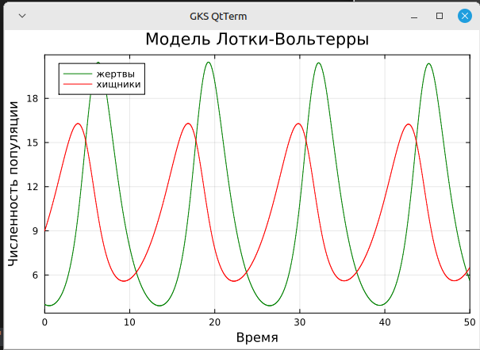
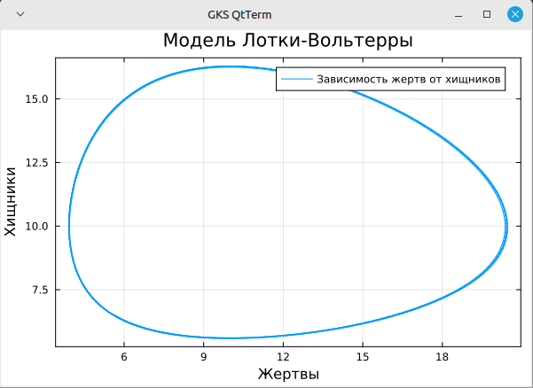
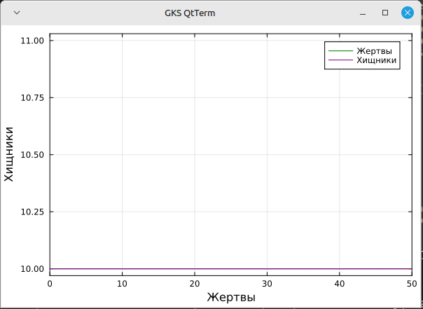
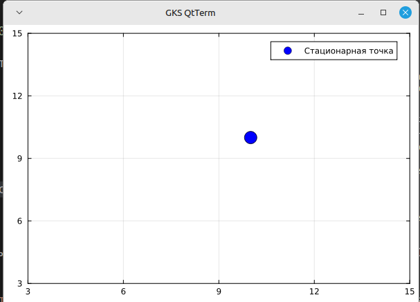

---
## Front matter
lang: ru-RU
title: Лабораторная работа №5
subtitle: Математическое моделирование
author:
  - Дудырев Г. А.
date: 17 апреля 2025

## i18n babel
babel-lang: russian
babel-otherlangs: english

## Formatting pdf
toc: false
toc-title: Содержание
slide_level: 2
aspectratio: 169
section-titles: true
theme: metropolis
header-includes:
 - \metroset{progressbar=frametitle,sectionpage=progressbar,numbering=fraction}
---

## Докладчик

:::::::::::::: {.columns align=center}
::: {.column width="70%"}

  * Дудырев Глеб Андреевич
  * НПИбд-02-22
  * <https://github.com/GlebDudyrev>

:::
::: {.column width="30%"}


:::
::::::::::::::

## Цели и задачи

- Исследовать математическую модель Лотки-Волтьерры.


## Задача

Для модели «хищник-жертва»:

$$\begin{cases}
    &\dfrac{dx}{dt} = - 0.77 x(t) + 0.077 x(t)y(t) \\
    &\dfrac{dy}{dt} = 0.33 y(t) - 0.033 x(t)y(t)
\end{cases}$$

Построить график зависимости численности хищников от численности жертв, а также графики изменения численности хищников и численности жертв при следующих начальных условиях: $x_0 = 4, y_0 = 9.$ Найти стационарное состояние системы.

# Выполнение лабораторной работы

# Реализация на Julia

## Код

```Julia
# Используемые библиотеки
using DifferentialEquations, Plots

# Задание системы ДУ, описывающей модель Лотки-Вольтерры
function LV(u, p, t)
    x, y = u
    a, b, c, d = p
    dx = a*x - b*x*y
    dy = -c*y + d*x*y
    return [dx, dy]
end
```

## Код

```
# Начальные условия
u0 = [4, 9]
p = [-0.77, -0.077, -0.33, -0.033]
tspan = (0.0, 50.0)

# Постановка проблемы и ее решение
prob = ODEProblem(LV, u0, tspan, p)
sol = solve(prob, Tsit5())

# Построение графика
plot(sol, title = "Модель Лотки-Вольтерры", xaxis = "Время", yaxis = "Численность популяции", label = ["жертвы" "хищники"], c = ["green" "red"], box =:on)
plot(sol, idxs=(1, 2), title = "Модель Лотки-Вольтерры", xaxis = "Жертвы", yaxis = "Хищники", label="Зависимость жертв от хищников",box =:on)
```

## График

{#fig:1 width=70%}

## График

{#fig:2 width=70%}

## Стационарное состояние системы

$$\begin{cases}
  &x_0 = \dfrac{\gamma}{\delta}\\
  &y_0 = \dfrac{\alpha}{\beta}
\end{cases}
$$

## Стационарное состояние системы


В результате, $x_0 = \dfrac{0.77}{0.077} = 10$, а $y_0 = \dfrac{0.33}{0.033} = 10$.

## Проверка

```Julia
u0_c = [10, 10]
prob2 = ODEProblem(LV, u0_c, tspan, p)
sol2 = solve(prob2, Tsit5())

plot(sol2, xaxis = "Жертвы", yaxis = "Хищники", label = ["Жертвы" "Хищники"], c = ["green" "purple"], box =:on)
plot((10, 10), seriestype=:scatter, xlims=(3, 15), ylims=(3, 15), box =:on, c = "blue", markersize=10, label = "Стационарная точка")
```

## Проверка

{#fig:3 width=70%}

## Проверка

{#fig:4 width=70%}

## Вывод

В результате выполнения лабораторной работы я построила математическую модель Лотки-Вольтерры на Julia и в OpenModelica.